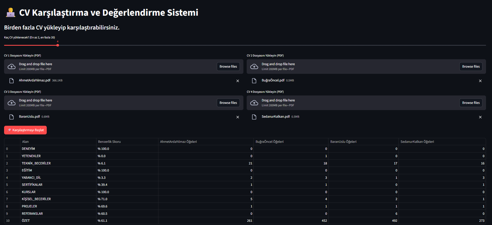
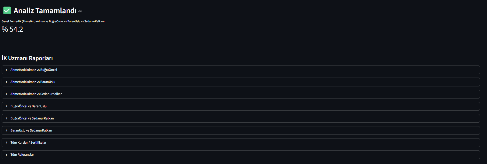

# 👨‍💻 Akıllı CV Karşılaştırma ve Değerlendirme Sistemi


<details>
  <summary>📸 <b>Uygulama Ekran Görüntülerini Görmek İçin Tıklayın</b></summary>
  <br>
  <p align="center">
    
    
  </p>
</details>


**NLP (Doğal Dil İşleme) ve OCR destekli, yeni nesil CV analiz aracı.**

Bu proje, geleneksel kelime eşleştirme yöntemlerinin ötesine geçerek, **Sentence-Transformers (SBERT)** ile anlamsal analiz yapar. Ayrıca **EasyOCR** entegrasyonu sayesinde taranmış (resim formatındaki) PDF'leri de okuyabilir.


## 🌟 Öne Çıkan Özellikler

- 🧠 **Anlamsal Zeka**: "Yazılımcı" ve "Developer" kelimelerinin aynı olduğunu anlar (SBERT)
- 👁️ **OCR Desteği**: Metin seçilemeyen resim PDF'lerini otomatik tanır ve okur (EasyOCR)
- 📊 **Detaylı Raporlama**: Adayları Deneyim, Eğitim ve Yetenek başlıklarında ayrı ayrı puanlar
- ⚡ **Hızlı Arayüz**: Streamlit ile sürükle-bırak kolaylığı
- 📈 **Çoklu Analiz**: 20 adaya kadar toplu karşılaştırma imkanı


## 🛠️ Kullanılan Teknolojiler

| Alan | Teknoloji | Amaç |
|------|-----------|------|
| **Arayüz** | Streamlit | Web arayüzü ve kullanıcı etkileşimi |
| **Parsing** | pdfplumber & PyMuPDF | PDF okuma ve işleme |
| **OCR** | EasyOCR | Taranmış belgelerden metin okuma |
| **NLP** | spaCy & Transformers | Veri ayıklama ve anlamsal analiz |
| **ML** | sentence-transformers | Semantik benzerlik hesaplama |
| **Metrikler** | scikit-learn | Cosine similarity ve karşılaştırma |


## 🚀 Kurulum ve Çalıştırma

Projeyi bilgisayarınızda çalıştırmak için aşağıdaki adımları izleyin:

### 1. Sanal Ortamı Hazırlayın

```bash
python -m venv cv_compare_env
```

**Windows için:**
```bash
cv_compare_env\Scripts\activate
```

**Mac/Linux için:**
```bash
source cv_compare_env/bin/activate
```

### 2. Kütüphaneleri Yükleyin

```bash
pip install -r requirements.txt
```

### 3. Dil Modelini İndirin

```bash
python -m spacy download en_core_web_sm
```

### 4. Uygulamayı Başlatın

```bash
streamlit run app.py
```


## 📂 Proje Yapısı

app.py: Web arayüzü ve ana uygulama

cv_parser.py: PDF okuma ve OCR modülü

comparison_engine.py: Semantik puanlama motoru

data_extractor.py: NLP veri ayıklama modülü

data/: Geçici CV kayıt klasörü

